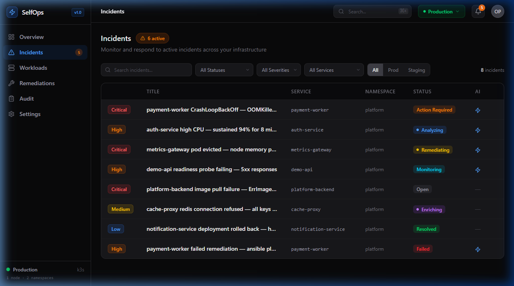
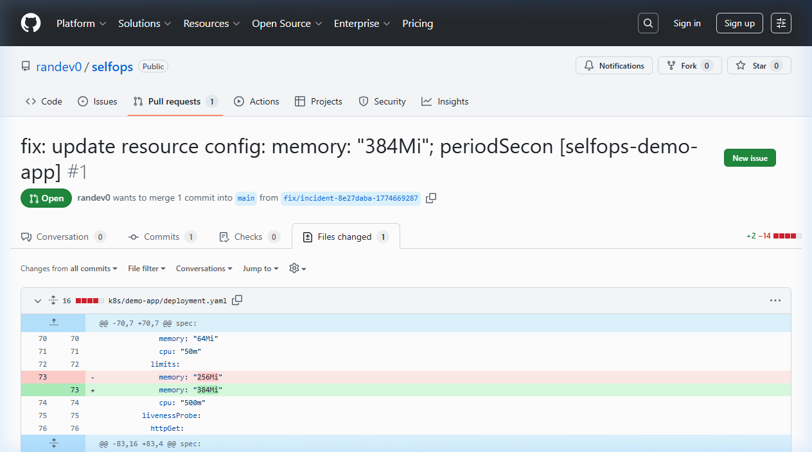
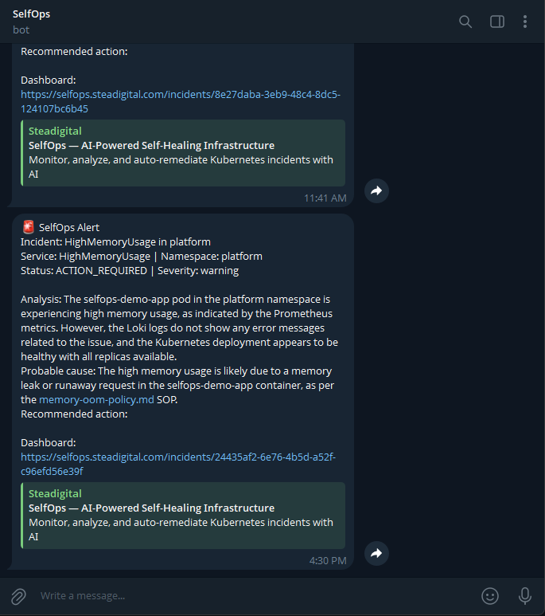
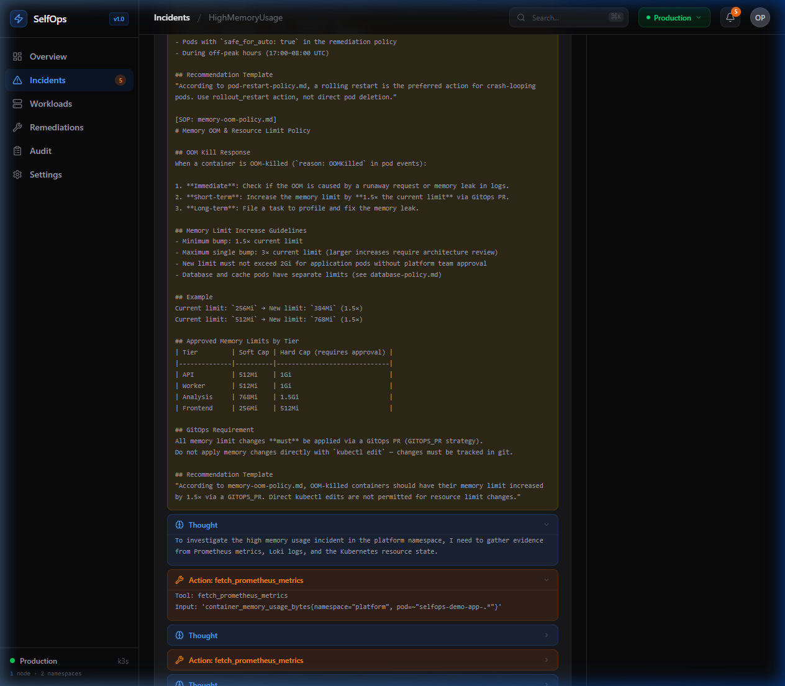

# SelfOps

### AI-Powered Self-Healing Infrastructure Platform

SelfOps watches your Kubernetes cluster, detects failures, runs an LLM-powered investigation using real metrics and logs, and either applies a safe fix autonomously or opens a GitOps pull request for human review — all with a complete audit trail.

**Live demo:** [selfops.steadigital.com](https://selfops.steadigital.com) · **API docs:** [api-selfops.steadigital.com/api/docs](https://api-selfops.steadigital.com/api/docs)

---



---

## The Problem

When a pod crashes at 3 AM, the on-call engineer spends 20 minutes doing the same thing every time: opening Grafana, checking restart counts, grepping Loki logs, reading the deployment YAML, and deciding whether to restart or scale. Then they document it in a ticket. Then they forget to follow the runbook.

SelfOps automates the investigation, enforces runbook compliance via policy retrieval, and either acts immediately or hands a ready-to-merge pull request to the human — not a raw incident dump.

---

## How It Works


---

## Features

**Autonomous detection**
- Alertmanager webhook ingests alerts in real time; deduplication by fingerprint
- Evidence collection: Prometheus instant queries + Loki log streams per incident

**Agentic investigation** _(Phase 1)_
- LangChain ReAct agent (Reason → Act loop, up to 6 iterations)
- Three live tools: `fetch_prometheus_metrics`, `fetch_loki_logs`, `get_k8s_resource`
- Every Thought / Action / Observation step stored in `investigation_log` for full traceability

**Two remediation strategies** _(Phase 2)_
- `DIRECT_ACTION`: runs an Ansible playbook immediately; starts 5-minute Prometheus verification
- `GITOPS_PR`: AI generates a minimal YAML patch → opens a GitHub PR → operator merges → kubectl apply → 5-minute verification

**MCP data layer** _(Phase 3)_
- Standalone `@modelcontextprotocol/sdk` server decouples data fetching from agent runtime
- Exposes MCP resources: `metrics://cpu-usage/{ns}/{pod}`, `k8s://pod-logs/{ns}/{pod}`
- REST bridge at `/api/tools/:name` lets the Python agent call tools synchronously

**Policy guardrails (RAG)** _(Phase 4)_
- Company SOPs in `docs/sop/` (Markdown)
- BM25Okapi retrieval injects the 2 most relevant policies into every investigation
- AI is required to cite the SOP in its recommendation, e.g.:
  > _"According to memory-oom-policy.md, OOM-killed containers must have their memory limit increased by 1.5× via a GITOPS_PR."_

**Operator dashboard**
- Next.js frontend: incident list, evidence, AI analysis, Agent Trace tab (collapsible thought process), GitOps PR cards with live status
- Grafana at [grafana-selfops.steadigital.com](https://grafana-selfops.steadigital.com)

**Full audit trail**
- Every alert, enrichment step, LLM call, action, and SOP retrieval is written to `audit_logs`
- `investigation_log` JSONB column stores the full ReAct chain per analysis

---

## Tech Stack

| Layer | Technology | Why |
|---|---|---|
| Orchestration | k3s (Kubernetes) | Lightweight, production-grade, single-node |
| Metrics | Prometheus + kube-prometheus-stack | Industry standard, rich ecosystem |
| Logs | Loki + Promtail | Grafana-native, cost-effective |
| Dashboards | Grafana | Best-in-class observability UI |
| Backend API | FastAPI + asyncpg | Async, typed, auto-docs |
| Job queue | ARQ (Redis-backed) | Simple async Python job queue |
| Database | PostgreSQL | ACID audit trail, JSONB for flexible evidence |
| Agent framework | LangChain 0.2 | ReAct loop, tool wrappers, callback hooks |
| LLM | OpenRouter → Claude 3 Haiku | Fast, cheap, structured JSON output |
| MCP server | `@modelcontextprotocol/sdk` (Node.js) | Decoupled data layer, MCP-native protocol |
| SOP retrieval | rank-bm25 | Zero-dependency keyword RAG over Markdown |
| GitOps | GitHub REST API | Branch + commit + PR — no extra CI needed |
| Remediation | Ansible + kubectl | Idempotent, auditable, human-readable |
| Frontend | Next.js 15 + Tailwind CSS v4 | SSR-capable, component-driven |
| Notifications | Telegram Bot API | Instant mobile alerts |
| Infrastructure | VPS | 4 vCPU / 8 GB 

---

## Architecture Diagram


---

## Demo Scenarios

### Scenario 1 — Pod Crash Loop _(~90 seconds end-to-end)_


```bash
./scripts/trigger-demo-crash.sh
# Then watch: https://selfops.steadigital.com/incidents
```

1. Crash fires → Alertmanager webhook → incident created (`OPEN`)
2. Worker enriches with Prometheus restart rate + Loki OOM logs (`ENRICHING`)
3. ReAct agent investigates: queries MCP server for metrics, checks k8s deployment state (`ANALYZING`)
4. BM25 retrieves `pod-restart-policy.md` → agent cites it in recommendation
5. Incident moves to `ACTION_REQUIRED`; Telegram notification arrives
6. Click incident → **Agent Trace** tab to see every Thought/Action/Observation step
7. Click **Actions** → Run "Rollout Restart" → Ansible executes → 5-minute Prometheus verification → `RESOLVED`

### Scenario 2 — GitOps PR Remediation _(recommended for demos)_



```bash
# Trigger a memory incident
curl -X POST https://api-selfops.steadigital.com/api/alerts/webhook \
  -H "Content-Type: application/json" \
  -d '{
    "alerts": [{
      "status": "firing",
      "labels": {"alertname": "HighMemoryUsage", "namespace": "platform", "severity": "warning"},
      "annotations": {"summary": "Container using 80%+ of memory limit"},
      "fingerprint": "gitops-demo-001"
    }]
  }'

# Wait ~40s for analysis, then trigger the GitOps path
INCIDENT_ID=$(curl -s https://api-selfops.steadigital.com/api/incidents?limit=1 | python3 -c "import json,sys; print(json.load(sys.stdin)[0]['id'])")

curl -X POST "https://api-selfops.steadigital.com/api/incidents/$INCIDENT_ID/actions/restart_deployment/run" \
  -H "Content-Type: application/json" \
  -d '{"parameters": {"deployment_name": "selfops-demo-app", "namespace": "platform"}, "strategy": "GITOPS_PR"}'
```

The agent generates a YAML patch (memory 1.5× bump), opens a GitHub PR, and sends a Telegram notification with the PR link. After merging, call `/merged` to apply and start verification.



### Scenario 3 — CPU Spike

```bash
./scripts/trigger-demo-cpu.sh
# HighCPUUsage alert fires in ~2 minutes
# Agent retrieves scaling-policy.md, recommends scale_up
```

---

## Agent Trace



Every analysis stores a full `investigation_log` with each step the ReAct agent took:

| Step type | Color | Meaning |
|---|---|---|
| `sop_context` | Yellow | SOPs retrieved and injected into the prompt |
| `thought` | Blue | Agent's reasoning before each action |
| `action` | Orange | Tool called (Prometheus / Loki / k8s API via MCP) |
| `observation` | Green | Raw data returned by the tool |
| `conclusion` | Purple | Final answer and JSON output |

---

## API Reference

Full OpenAPI docs: [api-selfops.steadigital.com/api/docs](https://api-selfops.steadigital.com/api/docs)

| Method | Endpoint | Description |
|---|---|---|
| `POST` | `/api/alerts/webhook` | Alertmanager webhook receiver |
| `GET` | `/api/incidents` | List incidents (paginated) |
| `GET` | `/api/incidents/{id}` | Full detail: evidence, analysis, actions, audit |
| `PATCH` | `/api/incidents/{id}` | Update status or severity |
| `POST` | `/api/incidents/{id}/actions/{action_id}/run` | Trigger remediation (`DIRECT_ACTION` or `GITOPS_PR`) |
| `POST` | `/api/incidents/{id}/actions/{action_db_id}/merged` | Notify that GitOps PR was merged → apply + verify |
| `GET` | `/api/incidents/{id}/actions` | List remediation actions |
| `GET` | `/api/incidents/{id}/audit` | Full audit log |
| `GET` | `/api/health` | Health check |

**MCP Server** (internal, `selfops-mcp.platform.svc.cluster.local:3001`)

| Endpoint | Description |
|---|---|
| `GET /sse` | SSE stream — connect any MCP-native client here |
| `POST /messages` | MCP message handler |
| `POST /api/tools/fetch_prometheus_metrics` | REST bridge: run a PromQL query |
| `POST /api/tools/fetch_loki_logs` | REST bridge: run a LogQL query |

---

## Running Locally

**Prerequisites:** Docker, k3s (or kind), Node.js 20+, Python 3.11+

```bash
git clone https://github.com/randev0/selfops.git
cd selfops
cp .env.example .env
# Fill in: OPENROUTER_API_KEY, TELEGRAM_BOT_TOKEN, TELEGRAM_CHAT_ID, POSTGRES_PASSWORD, GITHUB_TOKEN
```

```bash
# Port-forward everything from the cluster to localhost
export KUBECONFIG=~/.kube/config
./scripts/port-forward.sh
```

| Service | Local URL | Credentials |
|---|---|---|
| Frontend | http://localhost:3000 | — |
| API + docs | http://localhost:8000/api/docs | — |
| Grafana | http://localhost:3001 | admin / selfops-grafana-2024 |
| Prometheus | http://localhost:9090 | — |
| Alertmanager | http://localhost:9093 | — |

---

## Deploying from Scratch

1. Provision a VPS (4 vCPU, 8 GB RAM, Ubuntu 24.04)
2. Install k3s: `curl -sfL https://get.k3s.io | sh -`
3. Fill in `.env`; run `kubectl create secret generic selfops-secrets ...` (see `CLAUDE.md`)
4. Build and import Docker images: `docker build ... | k3s ctr images import -`
5. Apply manifests: `kubectl apply -f k8s/base/ -f k8s/platform/ -f k8s/monitoring/`
6. Run SQL migrations: `psql -f services/api/migrations/00{1,2,3}_*.sql`

See `CLAUDE.md` for the full phase-by-phase build guide.

---

## Project Structure

```
selfops/
├── services/
│   ├── api/                  FastAPI backend + PostgreSQL migrations
│   ├── worker/               ARQ async worker (enrich, analyze, notify, remediate)
│   ├── analysis-service/     ReAct agent + MCP client + BM25 SOP retriever
│   └── mcp-server/           TypeScript MCP server (Prometheus + Loki resources/tools)
├── services/frontend/        Next.js 15 dashboard
├── k8s/
│   ├── base/                 Namespace manifests
│   ├── monitoring/           Prometheus, Loki, Grafana Helm values + alert rules
│   └── platform/             All workload deployments, services, ingress, RBAC
├── infra/ansible/            Remediation playbooks (restart, rollout, scale)
├── docs/
│   ├── sop/                  Company SOP Markdown files (BM25-indexed)
│   ├── architecture.md
│   ├── data-model.md
│   └── api-spec.md
└── scripts/                  Demo trigger scripts, port-forward helper
```

---


